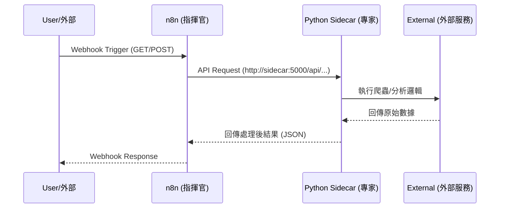
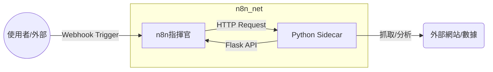

# n8n Sidecar Pattern (生產環境部署)

本專案展示如何透過 Docker Compose 建立一個具備 **Sidecar 架構** 的自動化環境，由 **n8n** 進行工作流編排，並調用 **Python 專業 Sidecar 服務** 執行數據處理任務。

## 1. 系統視覺化架構

### 系統資訊流 (Sequence Diagram)
展示請求與響應的時序邏輯：


### 物理架構圖 (Component Diagram)
展示容器間的依賴關係與資料流向：


## 2. 架構說明與目錄結構
本專案採用模組化 Sidecar 架構，以下為各目錄之功能對應：

```text
/home/user/n8n/
├── docker-compose.yml          # 微服務編排定義 (n8n + sidecar)
├── data/                       # [持久化] n8n 資料庫與工作流設定
├── logs/                       # [持久化] 容器生產環境執行日誌
├── files/                      # [持久化] 節點檔案存儲區
└── sidecar/                    # Python 邏輯服務模組
    ├── Dockerfile              # Python 執行環境建置
    ├── app.py                  # API 服務入口與路由註冊
    ├── requirements.txt        # Python 套件依賴
    └── routes/                 # 核心邏輯模組
        ├── analyzer.py         # 語意分析與字數統計
        └── scraper.py          # 網頁內容抓取
```

## 3. 架構細節
*   **n8n (指揮官)**: 負責流程編排、接收外部 Webhook 觸發，並透過內部網路調用 Sidecar。
*   **Python Sidecar (專業 Worker)**: 運行 Flask 服務，內建 `requests` 與 `beautifulsoup4`，負責執行實際的網頁抓取與邏輯分析任務。
*   **內部通訊**: 使用 Docker 內部網路 `n8n_net`，n8n 可透過 `http://sidecar:5000` 直接存取 Python 服務。

## 4. 系統維運
*   **自動化重啟**: 整合 Systemd 管理 (n8n-production.service)。
*   **更新邏輯**: 修改後執行 `docker compose up -d --build`。
