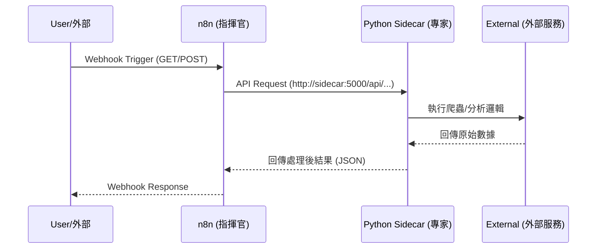

# n8n Sidecar Pattern (生產環境部署)

本專案展示如何透過 Docker Compose 建立一個具備 **Sidecar 架構** 的自動化環境，由 **n8n** 進行工作流編排，並調用 **Python 專業 Sidecar 服務** 執行數據處理任務。

## 1. 系統資訊流與通訊架構



## 2. 架構說明

*   **n8n (指揮官)**: 負責流程編排、接收外部 Webhook 觸發，並透過內部網路調用 Sidecar。
*   **Python Sidecar (專業 Worker)**: 運行 Flask 服務，內建 `requests` 與 `beautifulsoup4`，負責執行實際的網頁抓取與邏輯分析任務。
*   **內部通訊**: 使用 Docker 內部網路 `n8n_net`，n8n 可透過 `http://sidecar:5000` 直接存取 Python 服務。

## 3. 目錄結構

```text
/home/user/n8n/
├── docker-compose.yml          # 容器服務定義 (整合 n8n 與 Sidecar)
├── data/                       # n8n 資料持久化
├── logs/                       # 日誌持久化
├── files/                      # 檔案持久化
└── sidecar/                    # Python 執行環境
    ├── Dockerfile              # Python 執行環境建置檔
    ├── app.py                  # Flask API 主程式
    └── routes/                 # 功能模組路由
        ├── analyzer.py         # 字數統計模組
        └── scraper.py          # 網頁爬蟲模組
```

## 4. 快速啟動

### 1. 啟動服務
於 `/home/user/n8n/` 目錄下執行：
```bash
docker compose up -d --build
```

### 2. 服務存取
*   **n8n (指揮官)**: http://localhost:5678
*   **Python Sidecar API (專家)**: http://localhost:5000

## 5. 測試驗證方式

### 1. 直連 Sidecar API 測試 (開發調試)
直接測試 Python 容器邏輯，無需經過 n8n：
*   **爬蟲測試**: `curl -s "http://localhost:5000/api/scraper/scrape?url=https://www.google.com"`
*   **分析測試**: `curl -X POST "http://localhost:5000/api/analyzer/analyze" -H "Content-Type: application/json" -d '{"text":"測試內容"}'`

### 2. n8n 工作流觸發測試
透過 n8n Webhook 觸發：
*   `curl -X POST http://localhost:5678/webhook/analyze-trigger -H "Content-Type: application/json" -d '{"text":"測試內容"}'`

## 6. 系統維運
*   **自動化重啟**: 本專案整合 Systemd 管理 (`n8n-production.service`)，若容器意外停止，系統將自動修復並重啟。
*   **更新邏輯**: 修改 Sidecar 程式碼後，請執行 `docker compose up -d --build`。
